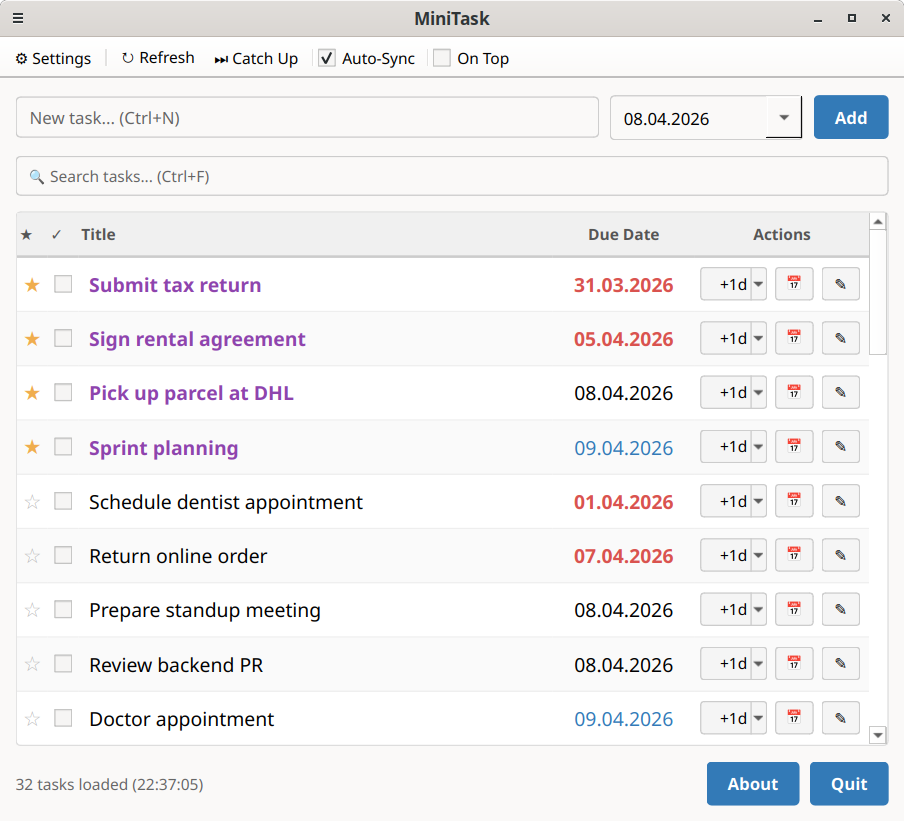
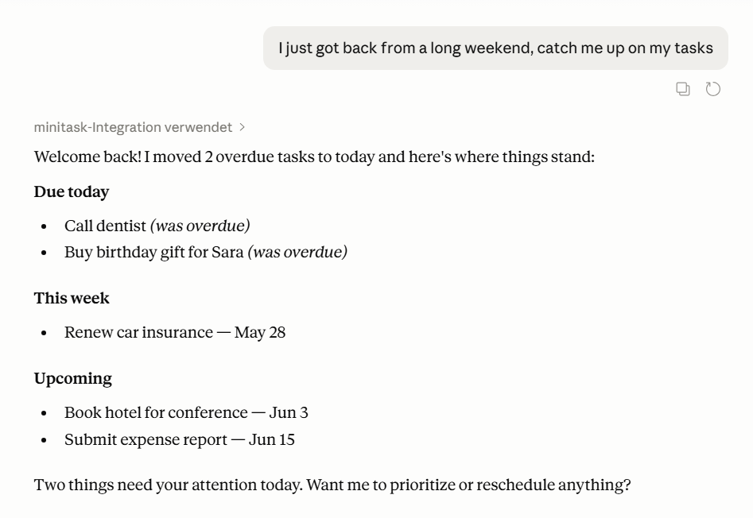
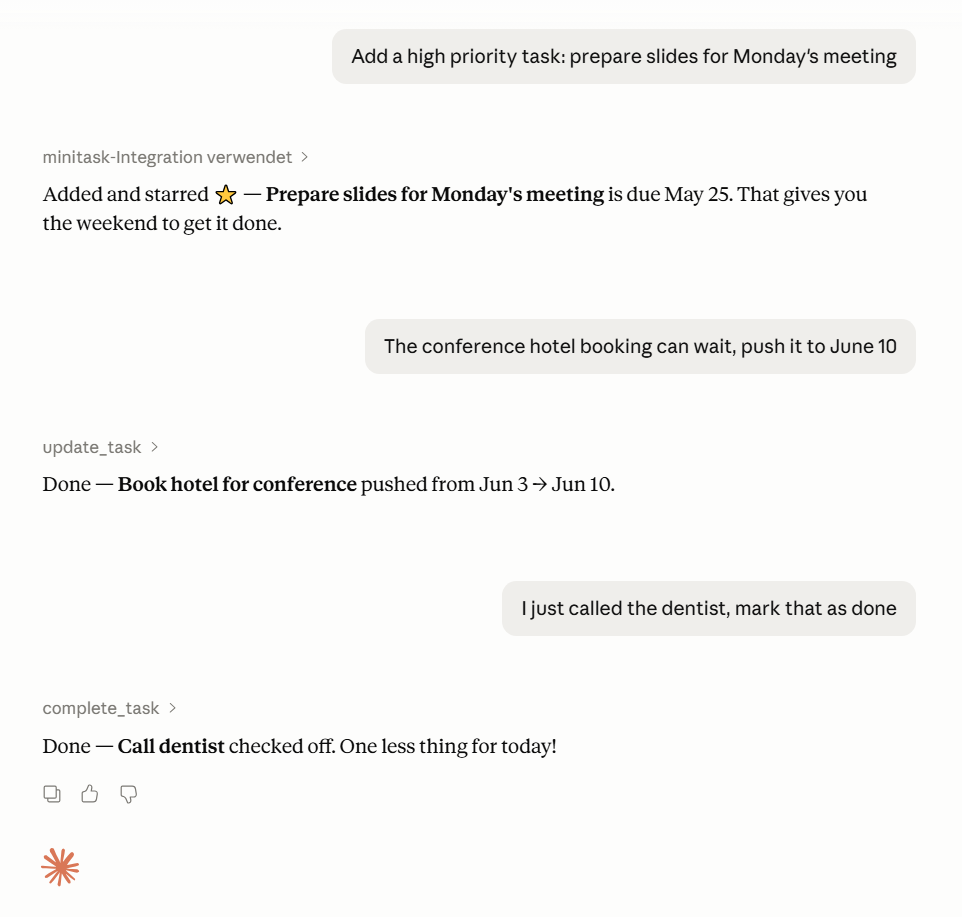

# MiniTask

A lightweight CalDAV task manager desktop application built with PySide6 (Qt6) and python-caldav — with built-in **MCP server** so any MCP-compatible AI client can manage your tasks directly via natural language.



## Features

- **MCP server included** — manage tasks via natural language from any MCP-compatible client: Claude Code, Claude Desktop, [Cowork](https://www.anthropic.com/product/claude-cowork), and more
- Connect to any CalDAV server (e.g. Nextcloud, mailbox.org, Radicale)
- Create, edit, and complete tasks with due dates
- Calendar popup for date selection
- Postpone tasks by +1 day, +1 week, or +1 month
- Set any task to today with one click
- "Catch Up" — set all overdue tasks to today at once
- Star/prioritize important tasks
- Color-coded due dates (overdue, today, future)
- Search and filter tasks
- Auto-sync every 60 seconds (toggleable)
- Undo completed (deleted) tasks within 5 seconds
- Keyboard shortcuts for fast workflow
- Always-on-top mode
- Secure credential storage via system keyring
- Remembers window position between sessions

## Requirements

- Python 3.12+
- A CalDAV server with task/todo support

## Installation

```bash
git clone https://github.com/Stefan-Schmidbauer/minitask
cd minitask
```

### Linux (Debian/Ubuntu)

MiniTask uses [Quickstrap](README.quickstrap.md) for installation and startup.

```bash
./install.py   # run once to set up the virtual environment
./start.sh     # start the app
```

`./install.py` interactively sets up a virtual environment and installs system dependencies (`libgl1`, `libegl1`) and Python packages (`PySide6`, `caldav`, `icalendar`). After that, use `./start.sh` to launch the app.

### Windows (manual)

The desktop app works on Windows, but there is no automated installer. Set up manually:

1. Install **[Python 3.12+](https://www.python.org/downloads/)**
   - Run the installer and make sure to check **"Add Python to PATH"** — without this, the `python` command won't be recognized in the terminal
   - Verify the installation by opening a terminal (`Win+R` → `cmd`) and running `python --version`

2. Open a terminal in the MiniTask directory and run:

```cmd
python -m venv venv
venv\Scripts\pip install PySide6 caldav icalendar keyring mcp
```

   This installs Qt (via PySide6) along with all required libraries — no separate Qt installation needed. On Windows, PySide6 bundles everything including the Qt DLLs, unlike Linux where some system libraries (`libgl1`, `libegl1`) must be installed separately.

   > **Note:** During `python -m venv venv` Windows may show an "Access Denied" dialog for a file called `lib64`. This is a symlink Python tries to create but doesn't need on Windows — click **Skip** and the virtual environment will work fine. To prevent this dialog permanently, enable **Developer Mode** in Windows Settings → System → For developers.

## Usage

**Linux:**
```bash
./start.sh
```

**Windows:**
```cmd
venv\Scripts\python main.py
```

On first launch, you will be prompted to enter your CalDAV server credentials and select a calendar.

### Developer Mode (Linux)

```bash
source quickstrap/activate.sh
python main.py
```

## Keyboard Shortcuts

| Shortcut   | Action              |
|------------|---------------------|
| `Ctrl+N`   | Focus new task input |
| `Ctrl+F`   | Focus search         |
| `F5`       | Refresh tasks        |
| `Ctrl+Z`   | Undo last completion |
| `Escape`   | Clear search         |

## Configuration

Settings are stored in:

- **Linux:** `~/.config/minitask/settings.json`
- **Windows:** `%APPDATA%/minitask/settings.json`

### Credential Storage

Passwords are stored securely in the system keyring and never written to the config file in plain text:

- **Linux:** GNOME Keyring or KWallet (accessed via subprocess to avoid Qt/D-Bus conflicts). A running keyring service is required (e.g. `gnome-keyring`, `kwallet`).
- **Windows:** Windows Credential Manager, accessed directly — no additional setup needed.

## MCP Server (Claude Code Integration)

MiniTask includes an MCP server (`mcp_server.py`) that lets Claude manage your tasks directly via natural language.

### Prerequisites

1. Configure credentials — **one of the following:**
   - **Desktop app already set up:** nothing to do, the MCP server reads credentials from the same keyring
   - **Without desktop app** (e.g. MCP-only on Windows, or headless Linux): run `setup_credentials.py` once:

```bash
# Linux
venv/bin/python setup_credentials.py

# Windows
venv\Scripts\python setup_credentials.py
```

`setup_credentials.py` is a small terminal script that asks for your CalDAV URL, username, and password, tests the connection, lets you pick a calendar, and saves everything securely to the system keyring (GNOME Keyring / KWallet on Linux, Windows Credential Manager on Windows). Run it once — or again whenever your credentials change.

### Setup

Copy the example for your system to `.mcp.json` and adjust the paths:

- **Linux:** copy `.mcp.json.linux.example`
- **Windows:** copy `.mcp.json.windows.example`

**Linux example** (`.mcp.json.linux.example`):
```json
{
  "mcpServers": {
    "minitask": {
      "command": "/home/yourname/minitask/venv/bin/python3",
      "args": ["/home/yourname/minitask/mcp_server.py"]
    }
  }
}
```

**Windows example** (`.mcp.json.windows.example`):
```json
{
  "mcpServers": {
    "minitask": {
      "command": "C:\\Users\\YourName\\minitask\\venv\\Scripts\\python.exe",
      "args": ["C:\\Users\\YourName\\minitask\\mcp_server.py"]
    }
  }
}
```

Restart Claude Code — the MCP server starts automatically as a subprocess, no separate service needed.

### Example


*"Catch me up on my tasks" — Claude moves overdue items to today and returns a structured overview.*


*Add a starred task, push a deadline, mark one done — natural language, no context switching.*

### Available Tools

| Tool | Description |
|---|---|
| `list_tasks` | Show all open tasks |
| `create_task` | Create a task (title + optional due date) |
| `update_task` | Edit title, date, or star a task |
| `complete_task` | Mark a task as done — removes it, same as checking it off in the app |
| `catchup` | Move all overdue tasks to today — same as "Catch Up" in the app |
| `list_calendars` | *(Setup)* List all calendars on the CalDAV server |
| `set_calendar` | *(Setup)* Switch to a different calendar |

### Credential Security

The MCP server reads credentials from the same system keyring as the desktop app — the password is **never stored in plain text**:

- **Linux:** GNOME Keyring or KWallet
- **Windows:** Windows Credential Manager (backed by DPAPI, encrypted with your Windows login)

## Third-party Libraries

MiniTask is built on the following open-source libraries:

| Library | Description | License |
|---|---|---|
| [PySide6](https://doc.qt.io/qtforpython/) | Qt6 bindings for Python — UI framework | LGPL-3.0 / GPL-2.0 / GPL-3.0 |
| [caldav](https://github.com/python-caldav/caldav) | CalDAV client library | MIT |
| [icalendar](https://github.com/collective/icalendar) | iCalendar format parser and generator | BSD |
| [keyring](https://github.com/jaraco/keyring) | Secure credential storage via system keyring | MIT |
| [mcp](https://github.com/modelcontextprotocol/python-sdk) | Model Context Protocol SDK (MCP server) | MIT |

## Contributing

Contributions are welcome! Feel free to open issues or submit pull requests.

## License

MIT License - see [LICENSE](LICENSE) for details.

## Authors

- Stefan Schmidbauer
- Claude (AI Assistant by Anthropic)
